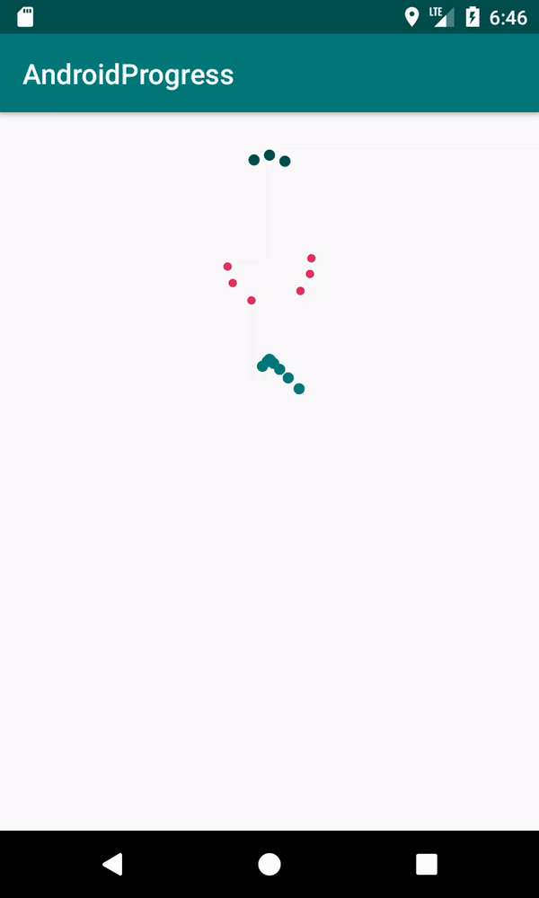

# Android Progress Bars

An open source library with a variety of progress bars.

## TypingProgressView

A progress bar that can be used to indicate when chat partner is typing.

## SqaureDotsLoadingView

Custom loading animation

## Usage

All configuration needs to be defined in the xml layout.
In future versions, I will add the ability to configure the views programmatically.

```xml
   <kukusot.progress.TypingProgressView
            app:circleColor="@android:color/holo_blue_dark"
            app:circleRadius="5dp"
            app:circleSpacing="4dp"
            app:circleTravel="20dp"
            app:numDots="3"
            app:animationDuration="2000"
            android:layout_width="wrap_content"
            android:layout_height="wrap_content"/>
```

```xml
  <kukusot.progress.WindowsLoadingView android:layout_width="wrap_content"
                                         android:layout_height="wrap_content"
                                         android:layout_marginBottom="16dp"
                                         android:layout_marginTop="16dp"
                                         android:layout_gravity="center_horizontal"
                                         app:circleRadius="3dp"
                                         app:animationDuration="1500"
                                         app:radius="30dp"
                                         app:numDots="6"
                                         app:circleColor="@color/colorAccent"/>
```

```xml
   <kukusot.progress.SquareDotsLoadingView android:layout_width="wrap_content"
                                            android:layout_height="wrap_content"
                                            app:circleRadius="4dp"
                                            app:radius="40dp"
                                            app:numDots="8"
                                            app:circleColor="@color/colorPrimary"/>
```

